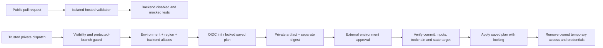

# Architecture

The framework keeps the original split between shared orchestration and environment-specific Terraform consumers. Azure is implemented; other clouds can reuse credential-free validation while their delivery adapters remain future work.

GitHub's outer `terraform-azure.yml` expands regions and calls `_terraform-azure-region.yml`. Each nested call owns its own plan output and apply gate, avoiding ambiguous matrix outputs. Azure DevOps retains the three-layer wrapper/stages/setup structure under `pipelines/azure-devops/azure/`. Bash and PowerShell wrappers share `scripts/azure/terraform.py`; helper parity is implemented in one place.

Workload aliases and backend aliases are independent. The default aliases preserve dev→pprd, shr→hub and bcdr→prd; state keys still include the requested environment, so aliases do not merge their states. Separate state keys use Terraform's default workspace. Custom workspaces are rejected.

A saved plan receipt binds the selected configuration, all tracked CI inputs (or relevant local input files), provider lockfile, Terraform version, source commit and run, and backend/workload selectors. The manifest hashes the plan; its own digest is transported separately as a job output. Source bindings are captured before plan and checked again afterward. Apply checks the protected branch has not moved and verifies the receipt before cloud authentication and immediately before apply.

These checks assume reviewed Terraform code, trusted dependency sources, trusted private runner administration and correct external approvals. They cannot prove that arbitrary provider aliases, scripts or remote modules honor the intended scope. Terraform providers and data sources execute code; public checks therefore receive no cloud permissions.

Backend locks protect state writes. GitHub concurrency serializes one consumer/environment/region. Azure's apply environment should have an exclusive-lock check with sequential behavior. Neither is a cross-repository lock for optional firewall rules; see [security](security.md).

The two original optional Ansible templates are a reviewed, deferred extension outside the Azure network release. No PFX/credential handling or Ansible execution is exposed by this implementation; the release does not claim those paths were restored.
